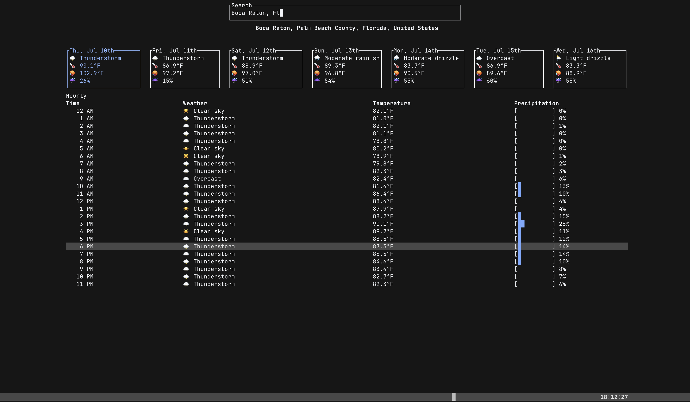

# Weather

<p align="center">
  
  
  
</p>



Weather is a terminal-based weather dashboard built with Rust and [ratatui](https://github.com/ratatui-org/ratatui). It provides real-time weather forecasts, including daily and hourly details, using the Open-Meteo API. The app features a search bar for location queries, a daily weather overview, and an interactive hourly weather table.

## How to Use

- Launch the app in your terminal.
- Use the search bar at the top to enter a city or location name.
- Press `Enter` to fetch and display the weather for the selected location.
- Navigate between days using the `Tab` and `Shift+Tab` keys to view daily forecasts.
- The hourly table updates to show detailed weather for the selected day.

### Keyboard Shortcuts

| Shortcut    | Action                         |
| ----------- | ------------------------------ |
| `Ctrl+C`    | Exit the app                   |
| `Enter`     | Search for location weather    |
| `Ctrl+R`    | Refresh weather data           |
| `Tab`       | Next day in daily forecast     |
| `Shift+Tab` | Previous day in daily forecast |

## How to Configure and Run

1. **Install Rust**  
   Make sure you have [Rust](https://rustup.rs/) installed.

2. **Clone the Repository**

   ```sh
   git clone https://github.com/oneirosoft/weather-it.git
   cd weather-it
   ```

3. **Build and Run**

   ```sh
   cargo run
   ```

4. **Configuration**
   - No API keys are required; the app uses the free Open-Meteo API.
   - Ensure you have an internet connection for fetching weather data.

Enjoy your weather dashboard in the terminal!
